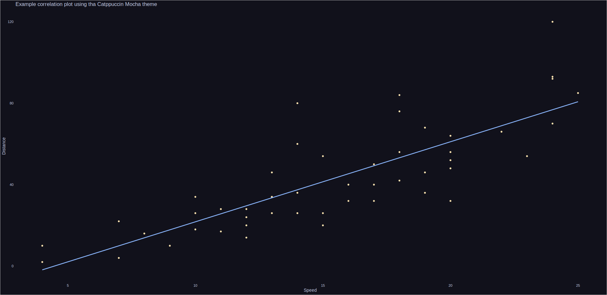
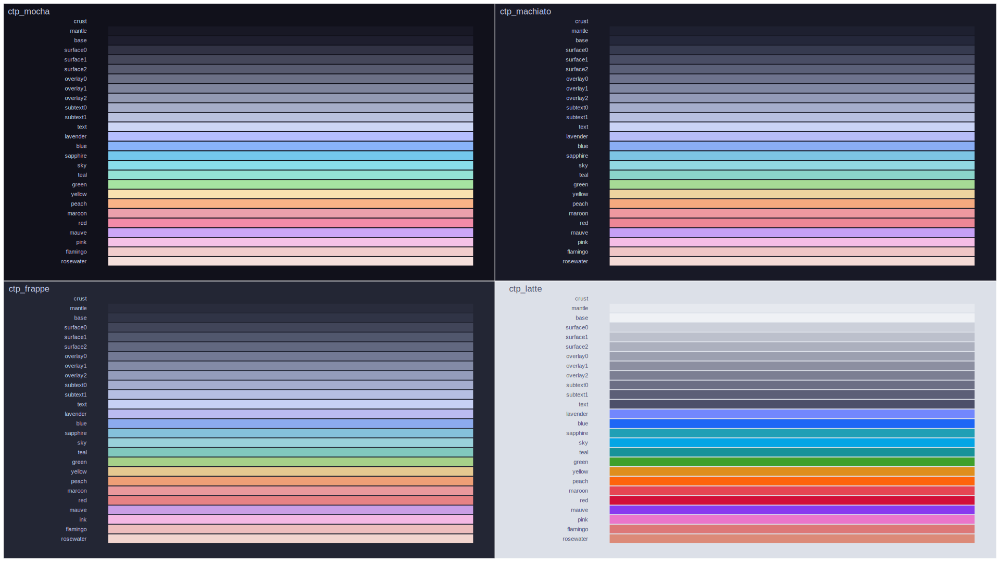

# ricethemes

**NOTE:** *This theme is still very much a work in progress. Expect breaking changes*

The term R.I.C.E stands for Race Inspired Cosmetic Enhancements and was used in
car tuning communities. Basically, it is a cosmetic upgrade, which have no
implications on performance. It is also a term widely used in desktop
customization. This ggplot theme is inspired by the desktop customization
enthusiasts and implements a popular theme,
[Catppuccin](https://github.com/catppuccin/catppuccin), and possibly more to
rice your ggplots. Although they will make your plots look a little bit nicer,
I can not guarantee a performance improvement.

# Installation

You can install this package using the [pak package](https://pak.r-lib.org/):

```R
pak::pkg_install("mackrics/ricethemes")
```

# Usage 

The package contains the four Catppuccin palettes:


You can use these to fetch the hex codes for each of the palettes, for example
`ctp_mocha` returns the entire palette, while `ctp_mocha[["yellow"]]` returns the hex code for the color yellow.

To apply these palettes to ggplot there are four functions


- `show_ctp_theme(ctp_theme)`
- `scale_fill_ctp(ctp_theme)`
- `scale_color_ctp(ctp_theme)`
- `theme_ctp(ctp_theme)`
- `theme_ctp_grid(ctp_theme)`

Where `ctp_theme` is  any of the four palettes:

- `ctp_mocha`
- `ctp_machiato`
- `ctp_frappe`
- `ctp_frappe`

# Example usage:

## Application

```R
library(ggplot2)
library(ricethemes)

ggplot(cars) +
  aes(speed, dist) +
  geom_point(color = ctp_mocha[["yellow"]]) +
  geom_smooth(color = ctp_mocha[["blue"]], se = FALSE, method = "lm") +
  theme_ctp(ctp_mocha) +
  labs(x = "Speed", y = "Distance") +
  ggtitle("Example correlation plot using tha Catppuccin Mocha theme")
```




## Show all themes

```R
library(ggplot2)
library(ricethemes)
library(patchwork)

list(ctp_mocha, ctp_macchiato, ctp_frappe, ctp_latte) |>
  lapply(show_ctp_theme) |>
  wrap_plots() +
  plot_annotation(tag_levels = list(c(
    "ctp_mocha", "ctp_machiato", "ctp_frappe", "ctp_latte"
  )))
```


